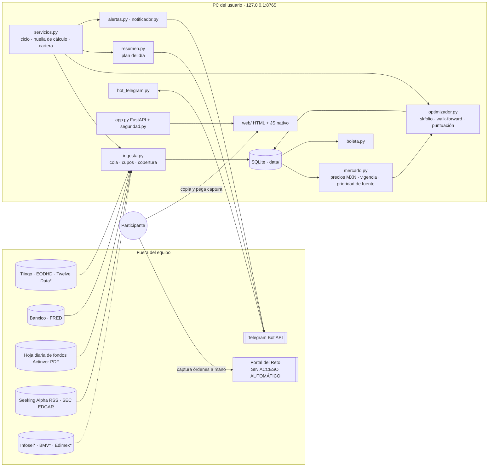

# Arquitectura — Actinver Terminal

Estado al **30-sep-2026**. Los diagramas de límites de confianza y de la ruta de una alerta están en [arquitectura.md](arquitectura.md). Las decisiones fechadas (D-01…D-45) están en [decisiones.md](decisiones.md).

## Vista general



`*` = conector listo, pendiente de contrato o clave.

## Procesos

| Proceso | Frecuencia | Qué hace |
|---|---|---|
| `servicios.ciclo` | 15 min con mercado abierto; 60 min cerrado; al iniciar | Ingesta → cobertura → propuestas (si cambian datos, código, perfil o catálogo) → alertas |
| `servicios.resumen_seguro` | cada 15 s (comprobación barata); evaluación completa ≤ cada 2 min | Plan del día y «plan corregido» |
| `bot_telegram` | long-poll | Responde solo a `TELEGRAM_CHAT_ID` |
| `tiempo_real` | opcional | Precio en vivo de Alpaca (IEX) si hay claves |

## Módulos clave

| Módulo | Responsabilidad |
|---|---|
| `config.py` | Carga `config/*.toml` y `.env` (secretos solo ahí) |
| `db.py`, `migraciones.py` | Esquema SQLite (~30 tablas) con disparadores de integridad |
| `ingesta.py` | Orden de cola (cartera → propuesta → nuevos → atrasados), cupos por proveedor, reserva de 6 consultas diarias EODHD para emisoras nuevas |
| `adaptadores/` | Un adaptador por proveedor; límites persistentes; errores explícitos |
| `cotizaciones.py` | «Precio confiable» para boletas (BMV licenciado, Infosel, EODHD BMV, Twelve Data, PDF de fondos, CSV manual) |
| `mercado.py` | Matriz de precios en MXN; `ajustados=True / False / "splits"` |
| `optimizador.py` | Universo filtrado (catálogo del simulador, reglas, perfil), MeanRisk, walk-forward, escenarios al horizonte del Reto |
| `servicios.py` | Ciclo del motor, `huella_calculo`, `huella_catalogo`, revalidación de propuestas, cartera (portal si hay captura vigente; si no, local) |
| `portal.py` | Interpreta la tabla copiada del portal; nunca lo consulta |
| `boleta.py` | Boletas de decisión y referencia condicional |
| `resumen.py` | Sesión objetivo, envío anticipado, reintentos, corrección antes de la apertura |
| `seguridad.py` | Host permitido, CSRF, origen; acceso remoto solo `*.ts.net` con cabecera de identidad de Tailscale |
| `estado_info.py` | Panel «¿En qué puedo confiar hoy?» |

## Datos: bases de precio

| Uso | Base |
|---|---|
| Optimización, ranking, boletas y alertas durante el Reto | Ajustado **solo por splits** (el Reto no paga dividendos) |
| Fuera del Reto | Ajustado por dividendos y splits |
| Valuación de la cartera | Cierre real |
| SIC | Cierre de la bolsa de origen × tipo de cambio del mismo día: referencia, no cotización del SIC |

Si dos fuentes tienen la misma fecha, se usa `mercado.PRIORIDAD_FUENTE`.

## Recálculo automático

Una propuesta guardada se marca `recalcular` y el motor la rehace si cambia cualquiera de estas cosas:

- el código de cálculo (`ARCHIVOS_CALCULO`);
- las reglas (`config/reto.yaml`);
- la configuración que afecta el cálculo;
- el perfil;
- el catálogo del simulador;
- la antigüedad de los datos.

## Seguridad

- Solo escucha en `127.0.0.1`. El acceso remoto es por Tailscale Serve, nunca Funnel ([acceso-remoto.md](acceso-remoto.md)).
- CSP y DOM construido con `textContent`. Importaciones: solo `.csv` de hasta 1 MB. Ver [seguridad.md](seguridad.md).
- No hay endpoints de órdenes. El portal del Reto nunca se automatiza.

## Ejecución

```
uv run terminal iniciar [--sin-navegador]
iniciar-remoto.bat          # Tailscale privado
uv run pytest
```

Comandos disponibles: `actualizar`, `respaldar`, `reporte`, `telegram`, `alpaca`, `comparar-modelos`, `investigar`, `cobertura`, `cobertura-twelvedata`, `fondos`, `claude`, `catalogo-simulador`, `boletas`, `webhook-secreto`, `demo`.
