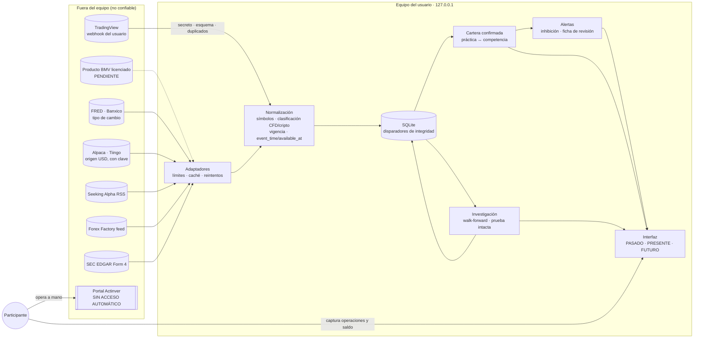
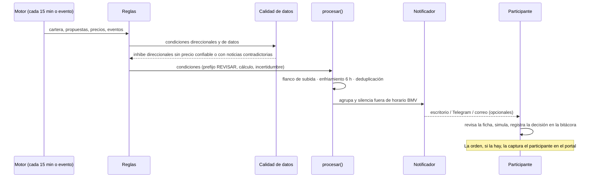

# Arquitectura, límites de confianza y ruta de una alerta

Diagramas en Mermaid: texto versionado y verificable, con el enfoque de `archify`.

## Flujo de datos y límites de confianza



## Ruta de una alerta



## Red de fuentes por instrumento

```mermaid
flowchart TB
  SICMXN["SIC:AAPL · MXN · XMEX"] ---|serie BMV licenciada| BMVs[(BMV)]
  SICMXN -.referencia, no sustituto.- ORIG["AAPL · USD · XNAS"]
  ORIG --- ORIp[(Alpaca/Tiingo)]
  SICMXN -.contexto.- SAc[(Seeking Alpha)]
  SICMXN -.insiders EE. UU.; NO CUBRE BMV.- SECc[(SEC)]
  LOCAL["BMV:AMX · MXN · XMEX"] --- BMVs
  LOCAL -.EOD con clave.- EOD[(EODHD)]
  CFD["Serie CFD / cripto"] -. rechazada por clasificacion.py .-x LOCAL
```
